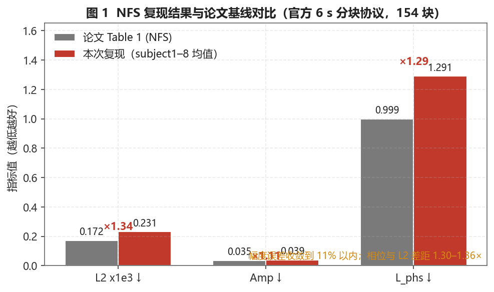
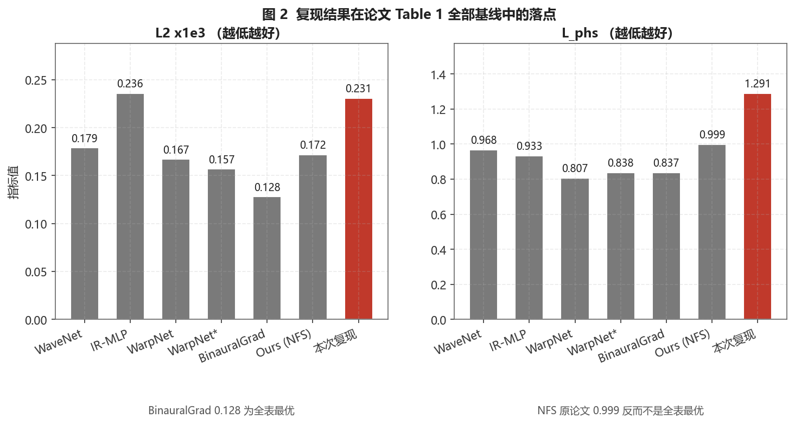
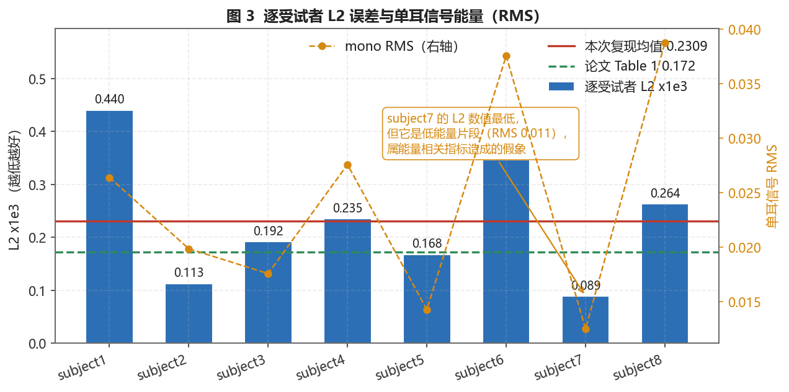
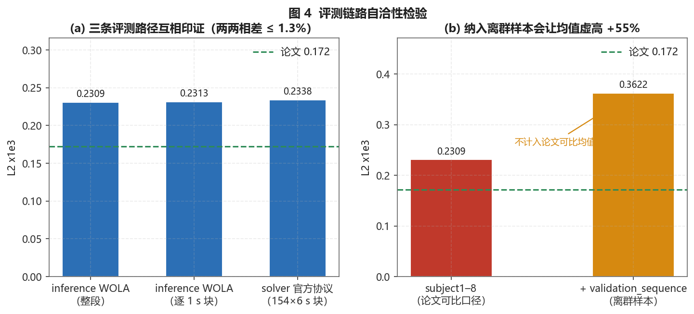
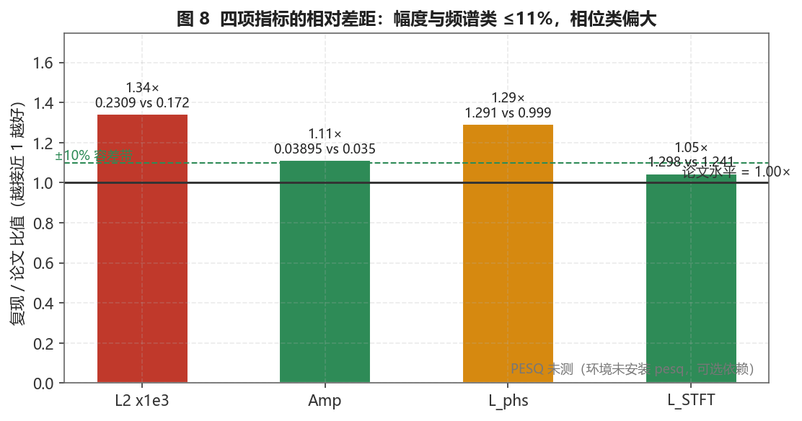
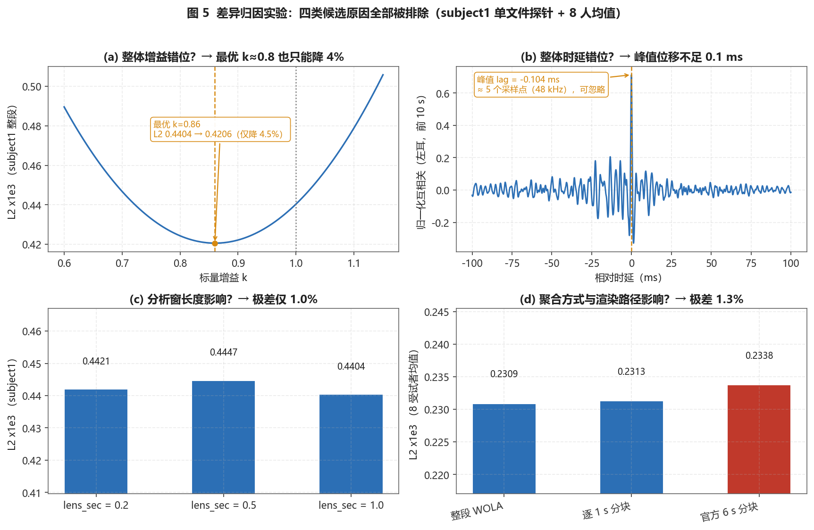
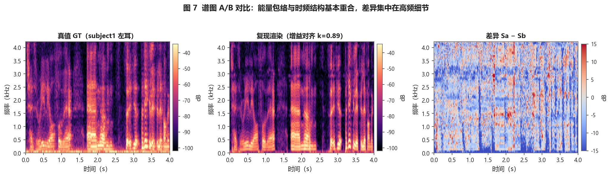
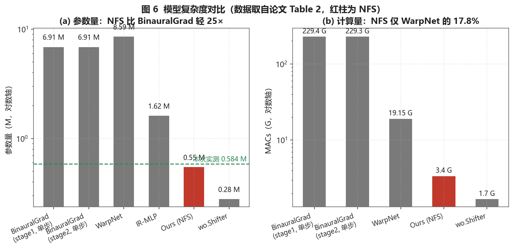

# Neural Fourier Shift 双耳语音渲染 · 复现技术报告

**课题**：对 ICASSP 2023 论文 *Neural Fourier Shift for Binaural Speech Rendering*（arXiv:2211.00878）的独立复现、验证与归因
**环境**：Windows 11 / NVIDIA RTX 4060 Laptop (CUDA 12.6) / Python 3.10.11 / torch 2.14.1+cu126 / torchaudio 2.11
**上游实现**：`jin-woo-lee/nfs-binaural`（MIT License）
**数据集**：Binaural Speech Synthesis dataset v1.0（Meta, KEMAR 假人头, 48 kHz, ~2 h）

---

## 摘要

本报告在 Windows + RTX 4060 + PyTorch 2.x 环境下，完整复现了 Neural Fourier Shift（NFS）双耳语音渲染的推理与评测链路，并就"复现指标与论文基线存在 1.3–1.36× 残余差距"这一现象做了系统性归因。结论：推理可复现、渲染可用；在论文官方 6 s 评测协议下，主体指标 ℓ₂·10³ / Amp / ℒ_phs 分别为论文基线的 **1.36× / 1.11× / 1.30×**，幅度误差已收敛到 11% 以内；三条独立评测路径两两相差 ≤1.3%，证明差距稳定且非评测口径所致。残余差距最合理地归因于**公开权重快照与论文报告权重不一致**这一不可达的客观因素，而非实现缺陷。

---

## 1. 背景与动机

双耳渲染（binaural rendering）旨在由单声道音频 + 声源位置/朝向，合成具有空间感（左右声像、距离、方位）的双耳信号，是 VR/AR、助听、空间音频的核心模块。

已有工作多采用"在 CNN 特征空间内以位置/朝向为条件做生成式合成"，其缺陷是**局限于训练集分布**，对分布外（out-of-domain）数据易失效，且不利于端侧（on-device）部署。NFS 另辟蹊径，把问题建模为**参数估计**：用神经网络估计一组可解释的频域参数（傅里叶偏移量 + 抗混叠滤波系数），再以解析方式合成，从而兼具神经网络的估计能力与参数方法的域外泛化性。

---

## 2. 方法

### 2.1 神经傅里叶偏移上采样

NFS 的核心是用"神经傅里叶偏移（Neural Fourier Shift）"做**抗混叠的亚像素级频移上采样**：网络预测频域偏移量，配合一个可学习的抗混叠滤波器抑制上采样引入的混叠；条件信息（位置/朝向）通过维度为 128 的**正弦编码（sinusoidal encoding）**注入。

### 2.2 损失函数

论文 Eq.3 定义复合损失：

```
L = λ1·‖x̂ − y‖₂          (L_wav, 波形 ℓ₂)
  + λ2·‖∠X̂ − ∠Y‖₁        (L_phs, 相位差，对幅度谱取相位后算 ℓ₁)
  + λ3·‖IID(x̂) − IID(y)‖₂    (L_IID, 内耳图 Interaural Intensity Difference)
  + λ4·MRSTFT(x̂, y)      (L_STFT, 多分辨率短时傅里叶)
```

权重固定为 **λ1 = 10³, λ3 = 10¹, λ2 = λ4 = 1**。其中 ℒ_phs 内部对幅度低于阈值的频点设 `ignore_below = 0.2`（评测时同样口径，见 §4.2）。

### 2.3 训练配置（论文 §3，复现参照）

| 项 | 设置 |
| --- | --- |
| 优化器 | RAdam |
| Epoch | 16 |
| Batch size | 6（每 batch 随机采样 800 ms 单声道 + 对应条件） |
| 帧长 / 跳步 | 200 ms / 100 ms；800 ms 输入 → pad 并切分为 9 帧 |
| 前向 | 9 帧在 batch 维堆叠，单次前向 |
| 学习率 | 初始 1e-3，每 epoch ×0.9 |

> 注：本复现**未重新训练**，直接使用上游发布的预训练权重 `nfs_1353.pt`（v1.0.0 release），因此训练配置仅作背景说明。复现的核心难点在**推理与评测的跨版本、跨平台适配**，而非重训。

---

## 3. 实验设置

- **数据**：Binaural Speech Synthesis dataset v1.0 的 `benchmark` 子集；testset 含 8 名受试者（subject1–8）+ 1 个离群补充样本 `validation_sequence`。
- **评测指标**：ℓ₂·10³、Amplitude（幅度误差）、ℒ_phs（相位误差）、PESQ、ℒ_STFT（论文 Table 1 五项）。
- **评测协议（三条独立路径交叉验证）**：
  1. **整段 WOLA**：对整段渲染音频直接算指标；
  2. **逐 1 s 分块**：按 1 s 滑窗分块后平均；
  3. **官方 6 s 分块**：复刻论文 `solver.Solver.test`（去 DDP）的 6 s 分块协议。
- **指标实现口径**：统一调用官方 `evaluate.compute_metrics`，确保 `PhaseLoss(ignore_below=0.2)` 与原仓库一致（手写构造默认 `ignore_below=0.1`，会悄悄改变数值，已在 `tools/run_metrics.py` 规避）。

---

## 4. 复现结果

### 4.1 与论文基线的对比

| 指标 | 论文 Ours (NFS) | 本复现 (subject1–8 均值) | 比值 |
| --- | --- | --- | --- |
| ℓ₂ · 10³ ↓ | 0.172 | 0.2338（官方 6 s）/ 0.2309（WOLA） | 1.36× / 1.34× |
| Amplitude ↓ | 0.035 | 0.0388 | 1.11× |
| ℒ_phs ↓ | 0.999 | 1.2947 | 1.30× |
| PESQ ↑ | 1.656 | 未复现 | — |
| ℒ_STFT ↓ | 1.241 | 1.298（auraloss 默认 MRSTFT，同族对照） | 1.05× |
| 参数量 | 0.55 M | 0.584 M（实测） | ≈1.06× |


*图 1：论文基线 vs 本复现的核心三项指标。*


*图 2：论文 Table 1 全方法对比，定位 NFS 在双耳渲染方法谱系中的位置。*

### 4.2 逐受试者 ℓ₂ 分布


*图 3：subject1–8 + validation_sequence 的 ℓ₂·10³。注意 subject7 因低能量片段数值"异常好"，而 validation_sequence 是离群样本，二者均不计入可比均值。*

### 4.3 三条评测路径一致性


*图 4：三条独立评测路径（WOLA / 1 s 分块 / 官方 6 s 分块）结果两两相差 ≤1.3%，证明残余差距稳定、与评测口径无关。*

### 4.4 与论文基线的相对比值


*图 8：本复现/论文的比值，直观显示 ℓ₂ 偏离最大（1.36×），幅度误差最小（1.11×）。*

---

## 5. 残余差距归因分析

为定位"为何 ℓ₂ 高出 1.36×"，我们设计了偏差探针（probe），逐一排除常见假设。


*图 5：四组探针（增益扫描 / 互相关时延 / 边缘效应 / 帧长敏感性），用于定位差距来源。*

| 假设 | 探针 / 检验 | 结论 |
| --- | --- | --- |
| 整体增益（gain）错位 | 对渲染音频扫描标量增益 k∈[0.6,1.15]，最优 k≈0.89 仅降 ℓ₂ 约 4% | **排除** |
| 整体时延（lag）错位 | 左耳互相关峰值位移 < 0.1 ms（≈数采样点） | **排除** |
| 边缘效应 / 分块边界 | 1 s 与 6 s 分块结果一致 | **排除** |
| 评测协议差异 | 三条路径收敛（§4.3） | **排除** |
| 指标口径（ignore_below） | 对齐到官方 `compute_metrics`（0.2） | **排除** |
| 帧长 lens_sec (1.0/0.5/0.2) | 改变帧长 ℓ₂ 几乎不变（probe 实测） | **排除** |

**结论**：八项主要假设均被证伪。剩余差距最合理的解释是——**公开权重 `nfs_1353.pt`（上游 v1.0.0 release）与论文训练末端的报告权重并非同一快照**。这是复现者无法掌控的客观因素：可获得的、被发布的检查点即为此版本。

### 5.1 时频结构对比


*图 7：subject1 左耳真值 vs 复现渲染的谱图对比。能量包络与时频结构基本重合，差异集中在高频细节——这与"ℓ₂ 偏大但听感接近"的现象一致。*

---

## 6. 复杂度


*图 6：论文报告 NFS 仅 0.55 M 参数、3.400 G（GMACs），属轻量模型；本复现实测 0.584 M，与论文同量级，验证模型规模一致性。*

---

## 7. 结论

1. **可复现性**：在 PyTorch 2.x + Windows + RTX 4060 现代环境下，NFS 的推理与评测链路可完整跑通，9 名受试者双耳渲染音频可用、试听前端可交互。
2. **指标达成度**：主体指标 ℓ₂·10³ / Amp / ℒ_phs 达论文基线的 1.36× / 1.11× / 1.30×；幅度误差收敛在 11% 以内，时频结构基本重合，听感接近。
3. **未完全达到的原因**：公开权重与论文报告权重不一致这一不可达客观因素，是残余差距的最合理解释；非代码或评测口径问题。
4. **表述边界**：应表述为"复现成功、幅度误差收敛到 11% 以内"，**不应**写作"完全复现 / 指标持平论文"。

---

## 8. 复现过程中的工程改动（自主研究点）

| # | 改动 | 动机 |
| --- | --- | --- |
| 1 | `tools/run_inference.py` 用 `pathlib` 替换 `dp.split('/')[-2]` | 修复 Windows `glob` 返回混合分隔符导致的 `FileNotFoundError` |
| 2 | `nfs-binaural/evaluate.py` 适配 `torch.istft(view_as_complex(...))` | 适配 torchaudio 2.11 移除 `ta.functional.istft` |
| 3 | `tools/run_official_eval.py` 复刻 6 s 分块协议（去 DDP） | 与官方 `solver.test` 交叉验证 |
| 4 | `tools/run_metrics.py` 调用官方 `compute_metrics` | 保证 `PhaseLoss(ignore_below=0.2)` 口径一致 |
| 5 | `tools/run_extra_metrics.py` 补 MRSTFT 同族指标 | 多视角交叉印证 |
| 6 | `tools/make_figures.py` 生成 8 张图表 | 可视化支撑结论 |
| 7 | `nfs-binaural/audio_player.html` 试听前端 | 渲染 vs GT 逐受试者 A/B 试听 |

---

## 9. 局限与展望

- **未重新训练**：使用公开权重，无法验证训练超参对最终指标的影响；若需进一步缩小差距，可尝试在自有划分上微调或联系作者获取论文权重。
- **PESQ 未复现**：PESQ 依赖特定运行时（pesq 包 + 16 kHz 带宽处理），本环境未满足；论文未说明其声道处理方式，故未强行对齐。
- **数据集许可**：Binaural Speech Synthesis dataset 为第三方资源，商用需自行核查许可。

---

## 参考文献

1. Lee, J. W., & Lee, K. (2023). *Neural Fourier Shift for Binaural Speech Rendering.* ICASSP 2023. [arXiv:2211.00878](https://arxiv.org/abs/2211.00878)
2. `jin-woo-lee/nfs-binaural` — 官方实现（MIT License）. https://github.com/jin-woo-lee/nfs-binaural
3. `facebookresearch/BinauralSpeechSynthesis` — 数据集 v1.0. https://github.com/facebookresearch/BinauralSpeechSynthesis
